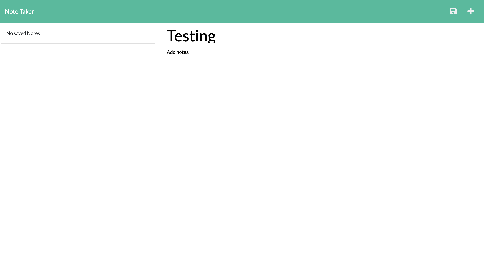
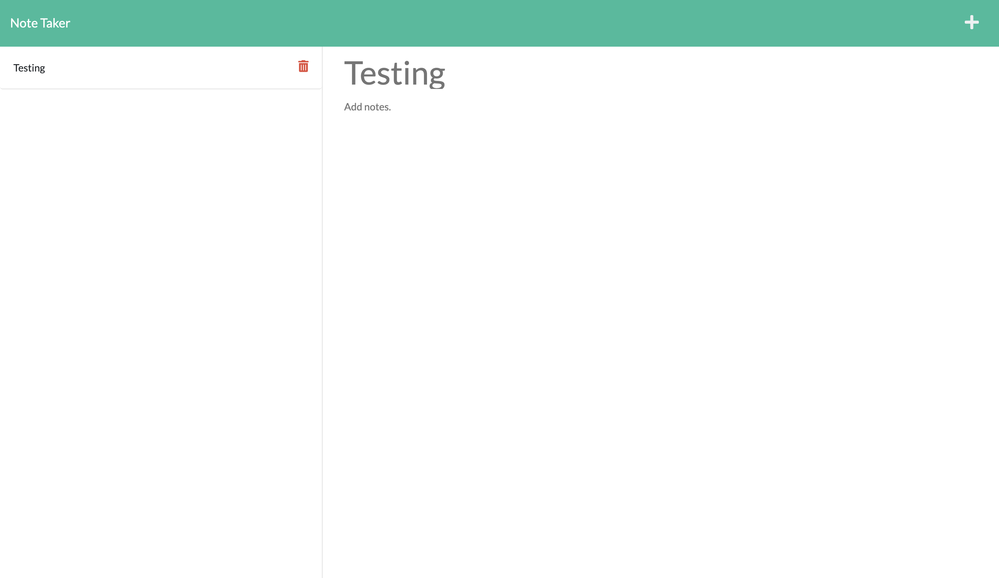

# Simple Note Taker

---
## Description

Modify starter code to create an application called Note Taker that can be used to write and save notes. This application will use an Express.js back end and will save and retrieve note data from a JSON file.

---
## Table of Contents

- [Installation](##Installation)

- [Usage](##Usage)

- [License](##License) 

- [Tests](##Tests)

- [Questions](##Questions)

---
## Installation

- First, use git clone in the terminal to download the project 
- Then open the project in VS Code and in the package.json folder enter the terminal 
- Within the terminal, use npm install to install the needed package
- The command-line application should work when npm start is entered in the terminal 

---
## Usage

This application can allow users to quickly and easily track notes.

### Screenshot:

### Deployment: [Heroku](https://arcane-brook-68952.herokuapp.com/notes) [GitHub Pages](https://bxz5089.github.io/Note_Taker/)

--- 
 ## License 
 
 https://opensource.org/licenses/MIT

---
## Tests
There are no tests for this application.

---
## Questions

If you have any questions or concerns please contact me at bxz5089@gmail.com or checkout my GitHub page at [bxz5089](https://github.com/bxz5089/).
